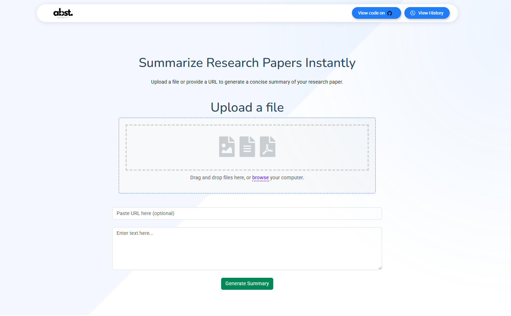
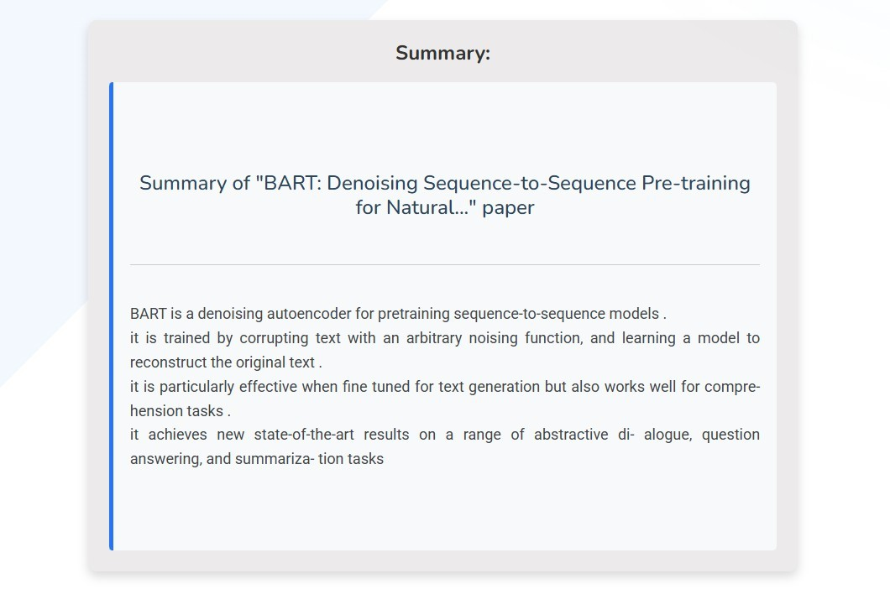

# arXiv Summarizer: _Project Abstractify_

This is a Flask app that uses a fine-tuned BART model (trained on arXiv datasets) to summarize research papers. The goal was to create a simple, easy-to-use tool for researchers to get concise summaries of lengthy papers.

---

## Project Status  
The project is **completed**! Here's what it includes:  
1. A functional Flask app to upload research papers and generate summaries.  
2. A fallback mechanism that formats outputs via a T5 base model for improved readability.  

---

## 🛠️ Setup Instructions  

### Requirements  
- Python 3.8 or above.  
- Virtual environment tools like `conda` or `venv` are highly recommended.  

### Steps to Run the Project  
1. **Clone the repository:**
   ```bash
   git clone https://github.com/Firojpaudel/arXiv_Summarizer.git
   cd arXiv_Summarizer
   ```
2. **Set up a virtual environment** *(recommended)*:

    Using `conda`:
    ```bash
    conda create -n arxiv_summarizer python=3.10  
    conda activate arxiv_summarizer  
    ```
    Or using `venv`:
    ```bash
    python -m venv venv  
    source venv/bin/activate (Linux/Mac)  
    venv\Scripts\activate (Windows)
    ```
3. **Install dependencies:**

    ```bash
    pip install -r requirements.txt
    ```
4. **Download the fine_tuned_bart model:**

    The model is not included here due to its size. Please download it from the following link and place it inside the directory:

    [Download Model](https://drive.google.com/drive/folders/17bDdytEe0sLysZ-x2g0K4Rtyi1YhOw2p?usp=sharing)
5. **Run the app:**

    ```bash
    python app.py
    ```
    The app will be hosted locally at `http://127.0.0.1:5000/`

---
## 🖼️ **How It Looks**

Here’s a quick preview of the app in action:

🏠 **Homepage:** 

<ul>
  This is where it all starts! Upload your research paper and get started.<br><br>
  
</ul>

**📝 Summarization in Action:**

<ul>
  Once your paper is uploaded, the app gets to work, breaking down complex research into digestible summaries.<br><br>
  
</ul>

**📄 Final Summary Output**

<ul>
  A clear, concise summary is generated for your research paper, formatted beautifully in markdown for readability.<br><br>
  
</ul>

---
## 🧠 Learnings & Challenges
- While BART works well for summarization, certain outputs lacked consistency due to variations in paper formats.
- The project demonstrated the limitations of fine-tuning on older datasets with diverse formatting styles.
- Future iterations could use a hybrid approach or train on more specialized datasets for better results.

---
## 📂 Repository Structure

```plaintext
arXiv_Summarizer/  
│  
├── app.py                   # Main Flask app  
├── fine_tuned_bart/         # Directory to store the fine_tuned_bart model (needed to be downloaded from drive) 
├── templates/               # HTML templates for the app  
├── static/                  # Static files (CSS, JS, images)  
├── README_images/           # Directory for README images  
├── requirements.txt         # Dependencies  
└── README.md                # Project documentation (this file)    
```
---
## 🤝 Contributions & License

This project is licensed under the MIT License. Feel free to use, modify, and distribute it as per the license terms.

### How You Can Contribute

We welcome all contributors who want to add value to this project! Whether it's improving summarization quality, refining the interface, or optimizing performance, your contribution matters.

To contribute, follow these steps:

1. **Fork the repository.**

2. **Create your feature branch:**
   ```bash
   git checkout -b feature-name
   ```
3. **Commit your changes:**
    ```bash
    git commit -m "Added a cool new feature"
    ```
4. **Push to the branch:**
    ```bash
    git push origin feature-name
    ```
5. **Open a pull request.**

---