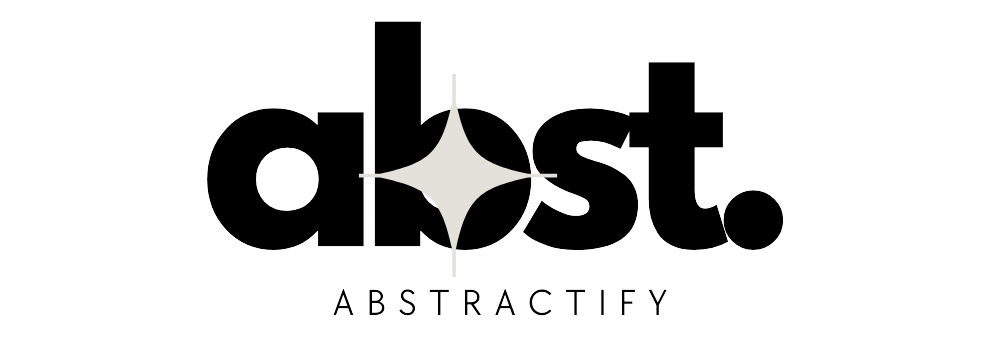

# arXiv Summarizer: _Project Abstractify_

This is a Flask app that uses AI-powered summarization to help researchers quickly understand complex academic papers. The application now includes **user authentication** and **personalized history** features, making it easier to manage and revisit your research summaries.

---

## 🆕 **New Features: User Authentication & Personal History**

### **🔐 Sign In with Google**
- **Google OAuth**: Sign in with your Google account for seamless access
- **Guest Mode**: Continue using the app without signing in (limited features)

### **👤 Personalized Experience**
- **Personal History**: Your summaries are saved and synced to your account
- **Cross-Device Access**: Access your summaries from any device
- **Secure Storage**: Your data is safely stored and associated with your account

---

## Project Status  
The project includes:  
1. **✅ AI-Powered Summarization**: Generate concise summaries of research papers
2. **✅ User Authentication**: Google OAuth integration  
3. **✅ Personal History**: Save and sync summaries across devices
4. **✅ LaTeX Support**: Beautiful rendering of mathematical equations
5. **✅ Modern UI**: Clean, responsive design with authentication features

---

## 🛠️ Setup Instructions  

### Requirements  
- Python 3.8 or above  
- Virtual environment tools like `conda` or `venv` (recommended)
- Google/Apple OAuth credentials (for authentication features)

### Steps to Run the Project  

#### 1. **Clone the repository:**
```bash
git clone https://github.com/Firojpaudel/arXiv_Summarizer.git
cd arXiv_Summarizer
```

#### 2. **Set up a virtual environment** *(recommended)*:

Using `conda`:
```bash
conda create -n arxiv_summarizer python=3.10  
conda activate arxiv_summarizer  
```
Or using `venv`:
```bash
python -m venv venv  
source venv/bin/activate  # Linux/Mac
venv\Scripts\activate     # Windows
```

#### 3. **Install dependencies:**
```bash
pip install -r requirements.txt
```

#### 4. **Configure Environment Variables:**

Copy the example environment file and configure your settings:
```bash
cp .env.example .env
```

Edit `.env` file with your credentials:
```env
# Required: Gemini API for summarization
GEMINI_API_KEY=your_gemini_api_key_here

# Required: Secret key for sessions
SECRET_KEY=your_secret_key_here

# Optional: Google OAuth (for Google sign-in)
GOOGLE_CLIENT_ID=your_google_client_id_here
GOOGLE_CLIENT_SECRET=your_google_client_secret_here
```

#### 5. **OAuth Setup (Optional but Recommended):**

**For Google OAuth:**
1. Go to [Google Cloud Console](https://console.developers.google.com/)
2. Create a new project or select existing one
3. Enable Google+ API
4. Create OAuth 2.0 credentials
5. Add authorized origins: `http://localhost:5000`
6. Add redirect URI: `http://localhost:5000/auth/google/callback`

#### 6. **Run the app:**
```bash
python app.py
```
The app will be hosted locally at `http://127.0.0.1:5000/`

---

## 🖼️ **How It Looks**

### 🏠 **Homepage with Authentication:**
The homepage now welcomes users and provides easy access to sign-in options.


### 🔐 **Sign In Page:**
Beautiful, secure sign-in page with Google OAuth.

### **📝 Summarization with User Context:**
Personalized experience with user information and saved history.


### **📄 Generated Summary:**
Clean, formatted summaries with LaTeX equation support.


### **🕑 Personal Summary History:**
Your personal collection of summaries, accessible anytime.


---

## 🚀 What's New in This Version

### **🔐 Authentication System**
- **OAuth Integration**: Seamless sign-in with Google
- **Session Management**: Secure user sessions with Flask-Session
- **User Profiles**: Store user information and preferences
- **Guest Mode**: Full functionality available without signing in

### **👤 User Management**
- **Personal History**: Summaries are linked to user accounts
- **Cross-Device Sync**: Access your summaries from anywhere
- **User Dashboard**: Manage your account and view statistics

### **🎨 Enhanced UI**
- **Modern Authentication UI**: Beautiful login page with Google sign-in
- **User Dropdowns**: Access user features from any page
- **Responsive Design**: Works perfectly on all devices
- **Flash Messages**: Clear feedback for user actions

### **🛡️ Security Features**
- **Secure Sessions**: Encrypted session management
- **OAuth 2.0**: Industry-standard authentication
- **Privacy-First**: Optional sign-in with guest mode available

### **📊 Database Enhancements**
- **User Management**: Store user profiles and authentication data
- **Relationship Mapping**: Link summaries to specific users
- **Migration Support**: Backward compatibility with existing data

---

## 📦 Database Models

### User Model
```python
class User(Base):
    __tablename__ = 'users'
    id = Column(Integer, primary_key=True)
    email = Column(String(255), unique=True, nullable=False)
    name = Column(String(255), nullable=False)
    provider = Column(String(50), nullable=False, default='google')  # Only 'google' now
    provider_id = Column(String(255), nullable=False)
    avatar_url = Column(String(500), nullable=True)
    created_at = Column(DateTime, default=datetime.utcnow)
    last_login = Column(DateTime, default=datetime.utcnow)
    
    summaries = relationship("SummaryHistory", back_populates="user")
```

### Enhanced Summary Model
```python
class SummaryHistory(Base):
    __tablename__ = 'summary_history'
    id = Column(Integer, primary_key=True)
    summary = Column(Text, nullable=False)
    original_url = Column(String, nullable=True)
    created_at = Column(DateTime, default=datetime.utcnow)
    user_id = Column(Integer, ForeignKey('users.id'), nullable=True)
    
    user = relationship("User", back_populates="summaries")
```

---

## 🧪 **Features & Benefits**

### **For Researchers**
- **Quick Summaries**: Get the gist of papers in seconds
- **Personal Library**: Build your collection of research summaries
- **LaTeX Support**: Properly rendered mathematical equations
- **Cross-Platform**: Access from any device with your account

### **For Institutions**
- **User Management**: Track usage and provide personalized experiences
- **OAuth Integration**: Leverage existing Google accounts
- **Scalable**: Designed to handle multiple users efficiently

### **For Developers**
- **Modern Auth Stack**: OAuth 2.0 with popular providers
- **Clean Architecture**: Separated authentication and business logic
- **Extensible**: Easy to add new OAuth providers or features

---

## 🔧 **Technical Stack**

### **Backend**
- **Flask**: Python web framework
- **SQLAlchemy**: Database ORM with user relationships
- **Authlib**: OAuth 2.0 client implementation
- **Flask-Session**: Secure session management

### **Authentication**
- **Google OAuth 2.0**: Sign in with Google
- **Session Security**: Encrypted cookies and secure storage

### **Frontend**
- **Bootstrap 5**: Modern, responsive UI components
- **Custom CSS**: Beautiful authentication interfaces
- **JavaScript**: Interactive elements and OAuth flows

### **AI & Processing**
- **Google Gemini 2.0 Flash**: AI-powered summarization
- **LaTeX Rendering**: MathJax for mathematical equations
- **Markdown Processing**: Rich text formatting

---

## 🚦 **Usage Modes**

### **Guest Mode** (No Sign-In Required)
- ✅ Generate summaries
- ✅ View current session summary
- ❌ Save summary history
- ❌ Cross-device access

### **Authenticated Mode** (With Sign-In)
- ✅ Generate summaries
- ✅ Save personal history
- ✅ Cross-device synchronization
- ✅ Personalized experience
- ✅ Future premium features

---

## 🔐 **Privacy & Security**

- **OAuth 2.0**: Industry-standard authentication
- **No Password Storage**: Rely on trusted OAuth providers
- **Encrypted Sessions**: Secure session management
- **Data Privacy**: User data is only stored with consent
- **Guest Option**: Full functionality without account creation

---

## 📂 Repository Structure

```plaintext
arXiv_Summarizer/  
│  
├── app.py                   # Main Flask app with authentication
├── auth.py                  # Authentication manager and OAuth setup
├── db.py                    # SQLAlchemy models (Users, Summaries)
├── .env.example             # Environment variables template
├── templates/               # HTML templates
│   ├── index.html          #   Homepage with auth UI
│   ├── login.html          #   Sign-in page
│   ├── summarize.html      #   Summarization with user context
│   └── history.html        #   Personal history page
├── static/                  # Static files (CSS, JS, images)
├── README_images/           # Screenshots for documentation
├── requirements.txt         # Python dependencies (updated)
├── history.db              # SQLite database (users + summaries)
└── README.md               # This documentation
```

---

## 🤝 Contributing

We welcome contributions! Here are some areas where you can help:

### **🔐 Authentication Enhancements**
- Add more OAuth providers (GitHub, Microsoft, etc.)
- Implement two-factor authentication
- Add user profile management

### **📊 Feature Additions**
- Export summaries to PDF/Word
- Summary sharing and collaboration
- Advanced search and filtering

### **🎨 UI/UX Improvements**
- Dark mode support
- Mobile app development
- Accessibility enhancements

### **⚡ Performance**
- Caching mechanisms
- Background processing
- API rate limiting

### **How to Contribute**

1. **Fork the repository**
2. **Create your feature branch:**
   ```bash
   git checkout -b feature/amazing-feature
   ```
3. **Commit your changes:**
   ```bash
   git commit -m "Add amazing feature"
   ```
4. **Push to the branch:**
   ```bash
   git push origin feature/amazing-feature
   ```
5. **Open a Pull Request**

---

## 📄 **License**

This project is licensed under the MIT License - see the [LICENSE](LICENSE) file for details.
---

## 🙏 **Acknowledgments**

- **Google Gemini**: For powerful AI summarization capabilities
- **OAuth Providers**: Google for secure authentication
- **Open Source Community**: For the amazing libraries and tools
- **Researchers**: Who inspired this tool to make research more accessible

---

**Ready to revolutionize your research workflow? Sign in and start summarizing! 🚀**
